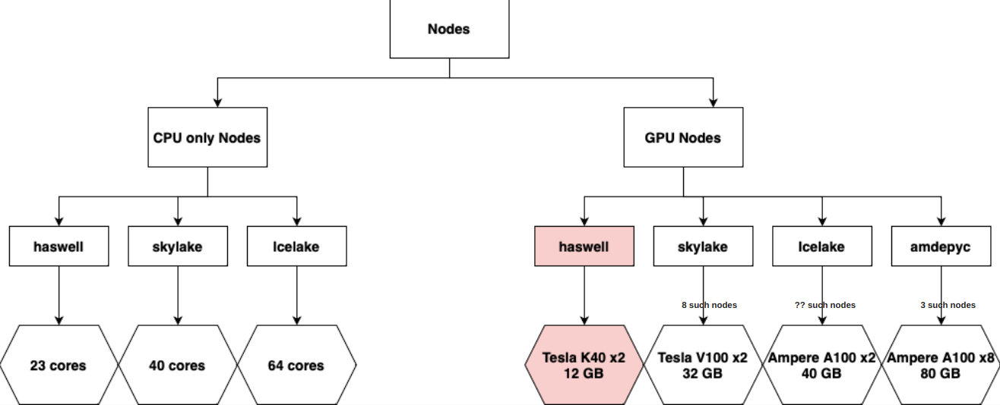

## IIT Delhi HPC commands/notes

- `ssh <username>@<remote server hostname>`  
ie:  
`ssh <IITD kerberos id>@hpc.iitd.ac.in`  
`ssh -X <IITD kerberos id>@hpc.iitd.ac.in`

- only one time env setup:
`source /home/apps/skeleton/oneTimeHPCAccountEnvSetup.sh`  

- ssh to different login node
    `ssh login01 # CPU login nodes 01,02,03,04`  
    `ssh klogin01 # GPU login nodes 01,02`

- some imp sommands: `pwd, ls, mkdir, cd, cat, cp, mv, rm, rmdir, man, top, logout, echo, scp`  
`pwd`  
op-> `/home/cse/msr/csy217550`  
`top`  
`top -u $USER #all the processes run by my user`

`echo $USER  #print this env variable`  
op-> `csy217550`

*copy something from local machine to HPC & vice versa*  
*-r for copying directories*  
`scp -r <source path on local machine> <iitd kerberos id>@hpc.iitd.ac.in:<destination path on hpc>`  

`scp -r bkapil.vfaculty@hpc.iitd.ac.in:/home/cc/vfaculty/skapil.vfaculty/source myfolder`  

- first I opened a new terminal and be on my PC instead of HPC,(becoz being on HPC, I don't know how to refer to my local computer)   (then without ssh do this:)
`spatni@IITD:~/git Repos/Research Project/HPC$ scp -r /home/spatni/git\ Repos/Research\ Project/HPC/scripts_for_net csy217550@hpc.iitd.ac.in:/home/cse/msr/csy217550/`

Command to Check Disk Quota Assigned to You  
- `lfs quota -hu $USER /home`  
- `lfs quota -hu $USER /scratch`  
- $HOME: 100 GB → Permanent Storage
- $SCRATCH: 25TB → Temporary : If storage becomes low data may be deleted without prior notice.
- Use $HOME for storing codes etc.
- Use $SCRATCH for model checkpoints, datasets etc.

`amgr login`  
`amgr ls project`  
#### departmental project  
`amgr checkbalance project -n <Project name>`  
`amgr checkbalance project -n cse `  

#### non-departmental project  
`amgr checkbalance project -n <Project name> -p global`  
`amgr checkbalance project -n col774 -p global`  

## MODULES  
-  you can install your softwares in your home. you can do whatever you want there. But u can load the already installed modules from hpc as well.
- `module avail`  
list of modules available on PADUM  
- `module -i keyword <keyword>`  
list all module files having provided keyword  
- `module load <module name/s>`  
load specific module/s in environment  
- `module list`  
list of modules already loaded in environment  
- `module unload <module name/s>`  
unload specific module/s from environment  
- `module purge`  
Unload all module/s from environment   

NOTE: modules which u are loading in your current working environment should not be conflicting each other.

---
## Nodes 

## PBS
### Job, Submission, Types, Monitor/Control ?
HOW TO SUBMIT :  
1. INTERACTIVE JOB SUBMISSION  
`qsub -I <qsub options>`
2. BATCH JOB SUBMISSION  
`qsub <batch script>`  
`qsub <qsub options> <batch script>`
`qsub -P <project_id> -q <standard/low/high> -lselect=1:ncpus=x:ngpus=y -lwalltime=10:00:00 -I`
- lwalltime is in `HH:MM:SS`.
- Haswell / Skylake nodes:
    `qsub -P col774 -q standard -lselect=1:ncpus=4:ngpus=1:centos=haswell/skylake -lwalltime=168:00:00 -I`
- Icelake nodes:
    `qsub -P col774 -q test -lselect=1:ncpus=4:ngpus=1 -lwalltime=168:00:00 -I`
- Amdepyc nodes:
    `qsub -P <department project> -q scai_lowq -lselect=1:ncpus=4:ngpus=1 -lwalltime=24:00:00 -I`

## Some points:
`qsub -I -q standard -N SampleJob -lselect=20:ncpus=12 -P cc -l walltime=01:00:00 `

meaning of `-lselect=20:ncpus=12:ngpus=1`:
20 nodes( or chunks)(any combination of haswell and skylake can be allocated depending on availability)  
12 cores each  
1gpu each  
Total cores : 20*12  

meaning of `-lselect=4:ncpus=12:ngpus=1:centos=skylake`
4 skylake nodes( or chunks)(Although we will land on one of those nodes after getting resources)  
12 cores each  
1gpu each  
Total cores : 4*12  
Total gpus: 4*1  

- full details of a job:  
`qstat -f <jobid>` ex: `qstat -f 21994.pbshpc`.
- **(v. useful after setting the process on queue, just run this to check the "estimated start time") and also if the job request is not valid, then it'll tell there**.

- show my all jobs, and their states:  
`qstat -u $USER`

- To check reason PBS report for your job, use command :  
`qstat -saw [JobID]` or `qstat -saw` to see for all users.

- To check estimated start time of your job, use command :  
`qstat -awT [JobID] ` or `qstat -awT` to see for all users.

- show all submitted jobs
`qstat -saw `

- for interective jobs: 
all outputs will be on terminal  
u can't hold a running job  
if you close the terminal, your interactive jobs will get terminated.  

- checking for my old finished(within last 24hrs) jobs  
`qstat -fx <jobid>`

- haswell = 24cores(2x12) , skylake = 40cores( 2x20)  
for ncpus=24, prefer haswell nodes becoz if u do skylake then 20cores will be in one socket and 4 might be on different socket, that will degrade your application's performance. 

### Internet in any IIT-D Macnines/Server/HPC.
- run proxy.sh to login to your proxy server `./src/proxy.sh` (edit the proxyXX according to your degree in proxy.sh first).
- set the appropriate proxy server according to your course: Note XX: is the degree id (replace xx with your degree)
`{'btech':22,'dual':62,'diit':21,'faculty':82,'integrated':21,'mtech':62,'phd':61,'retfaculty':82,'staff':21,'irdstaff':21,'mba':21,'mdes':21,'msc':21,'msr':21,'pgdip':21}`
- Now in every terminal where you want to use the internet, you need to set these environment varibles (`http_proxy, https_proxy`) to the proxy server in which you have logged in.  
    Run `source src/set.sh` to set the variables. (again edit the proxyXX according to your degree in set.sh first).
- the above 2 lines means that from now on send all request for internet to Proxy server(proxy21.iitd.ac.in:3128 or 10.10.78.21:3128)  

